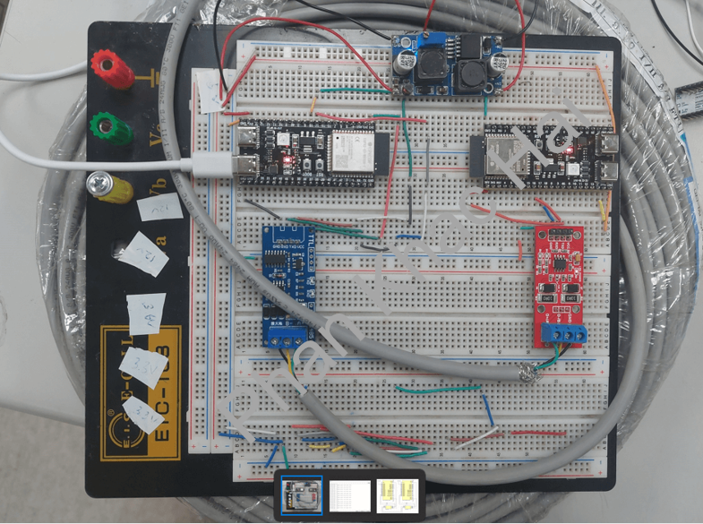
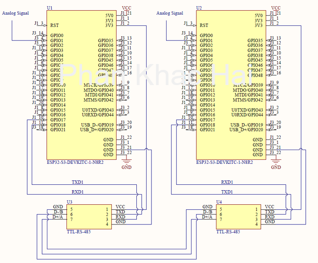
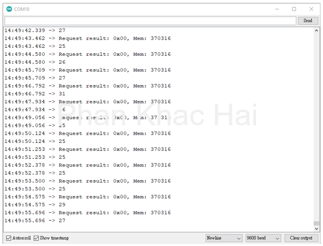

# ESP32-S3 RS-485 Communication

## Introduction

In this project, we'll explore how to establish RS-485 communication using ESP32-S3 devices. While this technology is a part of my work in developing wireless node sensors for tunnel structure displacement measurements, I'll focus on demonstrating the basics of RS-485 communication between two ESP32-S3 devices. This setup allows for data exchange and can be applied to various use cases.

## Hardware Setup

For this project, we'll be working with two ESP32-S3 devices, each integrated with RS-485 communication capabilities. To achieve RS-485 communication, we'll employ a simple TTL-RS485 module. Here's how to set up your hardware:

- **Master Device**: The ESP32-S3 device operating as the master should be connected as follows:
  - Connect the RS-485 module to the UART pins (TXD1, RXD1) on your ESP32-S3.
  - Connect the VCC and GND of the RS-485 module to the 3.3V and GND of your ESP32-S3, respectively.

- **Slave Device**: The ESP32-S3 device operating as the slave follows a similar connection pattern:
  - Connect the RS-485 module to the UART pins (TXD1, RXD1) on your ESP32-S3.
  - Connect the VCC and GND of the RS-485 module to the 3.3V and GND of your ESP32-S3, respectively.

This setup allows the master to send requests to the slave, and the slave responds with the requested data.

## Testing Circuit

For your convenience, here's a simple schematic of the hardware setup for RS-485 communication between two ESP32-S3 devices:

## Serial Monitor Output

Upon successful setup and execution of your RS-485 communication, you can monitor the communication through the serial monitor. Here's a sample output to expect:

Feel free to refer to this information while setting up your own ESP32-S3 devices for RS-485 communication.

## Code

Find the code for the master and slave ESP32-S3 devices in the 'master' and 'slave' directories, respectively. These examples demonstrate how to read data from a sensor connected to the slave and request and process that data from the master. Be sure to install any necessary libraries and follow the setup instructions provided in the code.

*Author: Phan Khac Hai - [Visit My Website](https://khphan.com/)*
